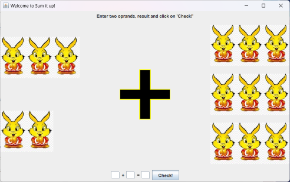
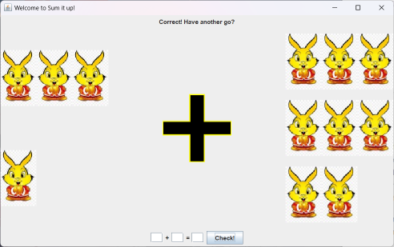
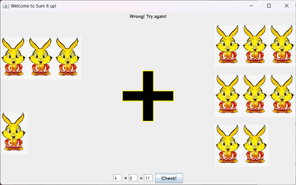

# MiniProject —— "Sum it up!"

**_SumItUp is a simple application for children where they can practise their counting and adding skills_**

## How to start "Sum it up!"

### For Task1

**Make sure you are in org directory, then run the code below in terminal.**

``` shell
java -cp .\Task1\class org.Task1.Main
```

### For Task2

**Make sure you are in org directory, then run the code below in terminal.**

``` shell
java -cp .\Task2\class org.Task2.Main
```

### For ExtraCredit

**Make sure you are in org directory, then run the code below in terminal.**

``` shell
java -cp .\ExtraCredit\class .\ExtraCredit\Main.java <a number between 10 and 25>
```

## How to use "Sum it up!"

* When you have successfully executed the program, then you can see the "Welcome to Sum it up!" frame.



* You need to fill in the two numbers being added on either side of the plus sign in the bottom text boxes based on the quantity of rabbit pictures on the left and right sides. Then, fill in the sum of those numbers in the text box to the right of the equals sign, then click the button.

  * if your answer is right, you will see the top text change to "Correct! Have an another go?", and you can repeat the sum practice
      

  * if your answer is wrong, you will see the top text change to "Wrong! Try again!". You need to check your answers, including the addends and the sum. Then try again.
      

## About Imporvement in Task2 and ExtraCredit

* The only difference between Task1 and Task2 is that in Task2, you can only input numbers from 1 to 10 in the addend text box at the bottom. You cannot input letters or numbers outside this range.

* In Task1 and Task2 the number of rabbits is from 1 to 10. In ExtraCredit, you can specify the maximum the number of rabbits, However, the maximum value cannot exceed the range of 10 to 25.
